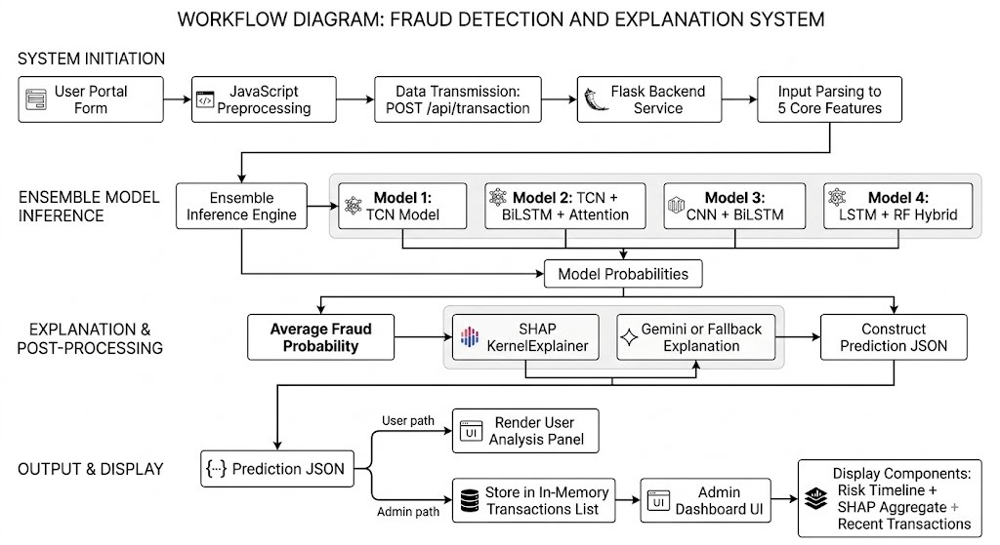
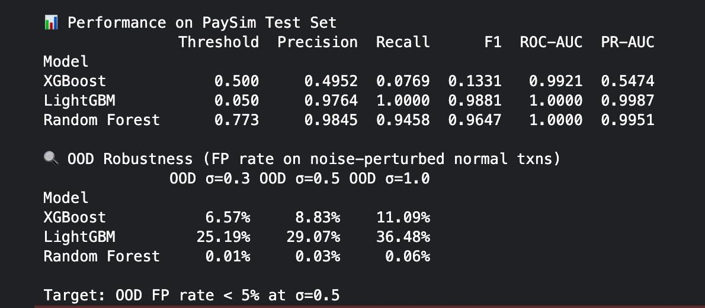
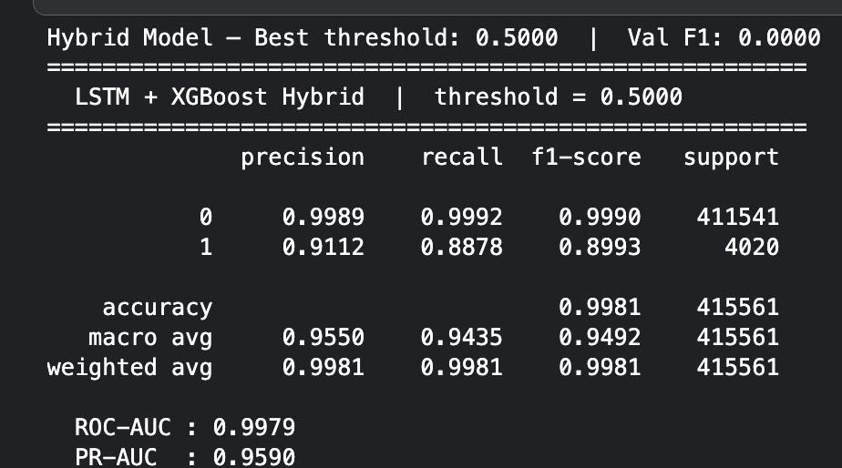
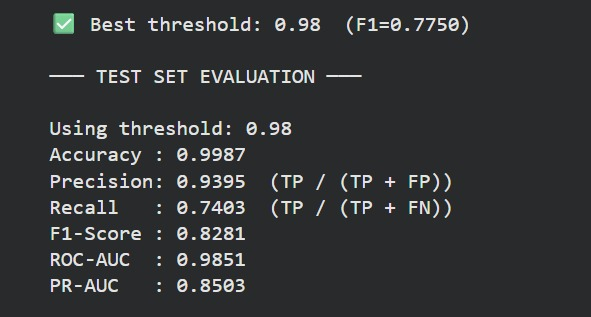
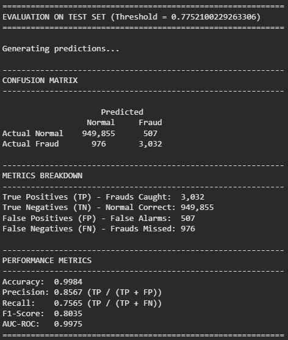
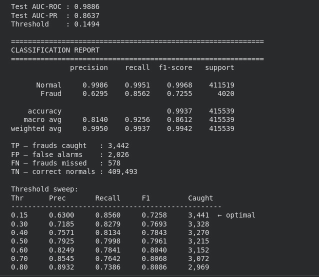
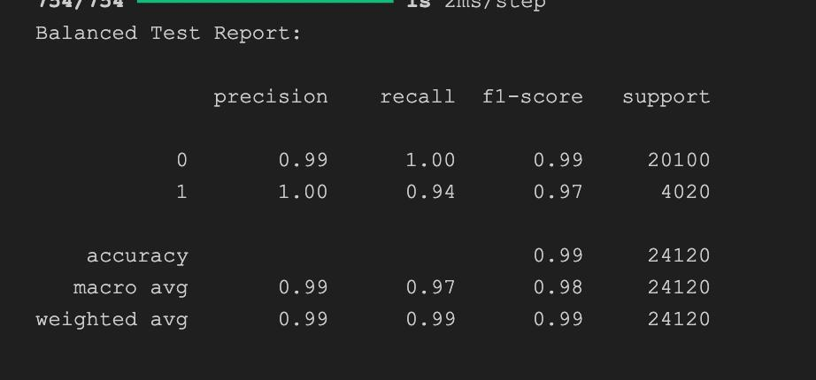

# FinGuard AI: Explainable Ensemble Fraud Detection for Digital Transactions

## Project Overview
- Duration: January 12, 2026 to April 7, 2026
- Project Mentors: Sarayu, Varshini, Siddhi
- Team Members: Adarsh, Shraddha, Shubh, Marwin

## 1. Introduction

### 1.1 Project Statement
FinGuard AI is a web-based fraud detection and transaction monitoring system designed to identify suspicious digital payment activity in real time. The platform accepts transaction details through a user-facing interface, evaluates them using an ensemble of machine learning and deep learning models, explains the decision using SHAP-based feature attribution, and presents both customer-facing and administrator-facing insights through a unified web application.

### 1.2 Background Survey
Digital transactions are now central to banking, wallet services, UPI platforms, and fintech applications. As transaction volumes increase, fraud detection systems must operate with high speed, high accuracy, and strong interpretability. Traditional rule-based systems are often not flexible enough to capture evolving fraud patterns, while single-model machine learning solutions may not generalize well across varied transaction behaviors.

To address these limitations, FinGuard AI adopts an ensemble approach that combines multiple model families, including temporal deep learning models and hybrid classifiers. In addition, explainability is treated as a core requirement. By integrating SHAP-based interpretation and a natural-language contextual explanation layer, the system not only predicts fraud risk but also helps users and administrators understand why a transaction was flagged.

## 2. Methodology

### 2.1 Techniques & Approach

#### Web Application Architecture
FinGuard AI follows a Flask-based client-server architecture with two primary interfaces:
- A user dashboard for entering transaction details and receiving fraud analysis.
- An admin dashboard for monitoring flagged transactions, feature importance trends, and recent prediction history.

#### Ensemble Modeling Strategy
The fraud prediction pipeline integrates four model components:
- TCN (Temporal Convolutional Network)
- TCN + BiLSTM + Multihead Attention
- CNN + BiLSTM
- LSTM + Random Forest Hybrid

Each model receives a standardized transaction representation derived from five core financial features:
- `amount`
- `oldbalanceOrg`
- `newbalanceOrig`
- `oldbalanceDest`
- `newbalanceDest`

The final fraud probability is computed by averaging the individual model outputs. A transaction is flagged as fraud when the ensemble probability crosses the decision threshold.

<!-- pagebreak -->
#### Feature Engineering
The system uses five core transaction inputs for general inference and additionally engineers derived features for models that require richer representations. For example, the CNN-based branch constructs extra behavioral signals such as balance wipe ratio, destination balance error, and cyclical time features. This makes it possible to support heterogeneous model architectures while preserving a unified application input format.

#### Explainability Layer
FinGuard AI uses SHAP Kernel Explainer to generate feature-level importance scores for the ensemble prediction. These scores are normalized and presented in descending order so that users can quickly understand the primary drivers behind a fraud alert.

#### Contextual Risk Explanation
Alongside the numerical prediction, the application produces a concise natural-language explanation of the transaction outcome. When an API key is available, the system uses Google Gemini to generate a professional risk summary. If not, it falls back to a deterministic explanation stub so the workflow remains functional.

#### Analytics and Reporting
Processed transactions are stored in runtime memory for the current session and surfaced in the admin dashboard. The dashboard visualizes:
- Total transactions processed
- Number of flagged fraud attempts
- Transaction risk timeline
- Aggregate SHAP feature importance
- Model benchmark summaries
- Recent transaction history

### 2.2 System Architecture & Workflow
The operational workflow of FinGuard AI is as follows:

1. The user enters sender, receiver, amount, and balance details in the transaction form.
2. The frontend automatically computes updated balances for origin and destination accounts.
3. The browser sends the transaction data to the Flask backend through the `/api/transaction` endpoint.
4. The backend loads the ensemble inference module and obtains prediction probabilities from all integrated models.
5. The system averages the model outputs to produce a final fraud probability score.
6. SHAP-based explainability is applied to rank the most influential transaction features.
7. A contextual natural-language explanation is generated for the final decision.
8. The prediction, explanation, and transaction metadata are returned to the user dashboard.
9. The same transaction is stored for session-level analytics and displayed in the admin dashboard.

#### Flowchart

<!-- pagebreak -->
### 2.3 Tools & Technologies Used
- Programming Languages: Python, HTML, CSS, JavaScript
- Web Framework: Flask, Jinja2
- Machine Learning Libraries: TensorFlow/Keras, PyTorch, scikit-learn
- Data and Utility Libraries: NumPy, pandas, joblib, python-dotenv
- Explainability: SHAP
- Visualization: Chart.js
- Generative AI Support: Google Generative AI API
- Model Types: TCN, BiLSTM, CNN, Attention-based sequence model, Random Forest hybrid classifier

## 3. Results & Analysis

### Model Exploration and Down-Selection
Before finalizing the deployed ensemble, multiple standalone, hybrid, and sequence-based architectures were evaluated. This selection stage helped identify not only the most accurate models, but also the most reliable combination of models for fraud detection under different operating conditions.

#### Standalone Baselines and Robustness Check
The first stage compared standalone tree-based baselines and also checked their robustness under noise-perturbed out-of-distribution (OOD) normal transactions.

| Model | Threshold | Precision | Recall | F1 | ROC-AUC | PR-AUC | OOD FP @ sigma=0.5 | Selection Outcome |
| --- | --- | --- | --- | --- | --- | --- | --- | --- |
| XGBoost | 0.500 | 0.4952 | 0.0769 | 0.1331 | 0.9921 | 0.5474 | 8.83% | Rejected due to very low recall and F1 |
| LightGBM | 0.050 | 0.9764 | 1.0000 | 0.9881 | 1.0000 | 0.9987 | 29.07% | Rejected due to high OOD false-positive rate |
| Random Forest | 0.773 | 0.9845 | 0.9458 | 0.9647 | 1.0000 | 0.9951 | 0.03% | Strong baseline, later absorbed into LSTM + RF hybrid |

This comparison was important for model selection. Although LightGBM achieved extremely strong in-distribution metrics, its OOD false-positive rate was too high for a fraud-monitoring workflow. Random Forest, on the other hand, was both accurate and stable, which justified retaining tree-based behavior inside the later hybrid architecture.

#### Hybrid and Deep Sequence Models
The next stage focused on temporal and hybrid models that could better capture sequential transaction behavior.

| Model | Threshold | Fraud Precision | Fraud Recall | Fraud F1 | ROC-AUC | PR-AUC | Selection Outcome |
| --- | --- | --- | --- | --- | --- | --- | --- |
| LSTM + XGBoost Hybrid | 0.5000 | 0.9112 | 0.8878 | 0.8993 | 0.9979 | 0.9590 | Not selected for deployment |
| LSTM + Random Forest Hybrid | 0.9800 | 0.9395 | 0.7403 | 0.8281 | 0.9851 | 0.8503 | Selected for final ensemble |
| TCN | -- | 0.9315 | 0.8187 | 0.8714 | -- | -- | Selected for final ensemble |
| CNN + BiLSTM | 0.7752 | 0.8567 | 0.7565 | 0.8035 | 0.9975 | -- | Selected for final ensemble |
| TCN + BiLSTM + Multihead Attention | 0.1494 | 0.6295 | 0.8562 | 0.7255 | 0.9886 | 0.8637 | Selected for final ensemble |
| Stacked LSTM | -- | 1.00 | 0.94 | 0.97 | -- | -- | Explored, not deployed |

<!-- pagebreak -->
The final four deployed models were selected as:
- TCN
- TCN + BiLSTM + Multihead Attention
- CNN + BiLSTM
- LSTM + Random Forest Hybrid

The selection rationale was as follows:
- LSTM + Random Forest remained the preferred hybrid model because it delivered a stronger deployment-ready precision profile than the other hybrid alternatives and was already integrated into the final application pipeline.
- Standalone Random Forest was already strong, and the hybrid version preserved that strength while adding sequence-based feature extraction.
- TCN contributed strong temporal pattern modeling and provided architectural diversity.
- TCN + BiLSTM + Multihead Attention improved recall-oriented detection and helped capture long-range sequence behavior.
- CNN + BiLSTM offered a complementary feature-learning pathway, improving ensemble diversity even though its fraud precision-recall tradeoff differed from the other models.
- Stacked LSTM showed promising performance in the provided evaluation screenshot, but it was kept as an exploratory model rather than part of the final deployed ensemble.
- Standalone LightGBM and XGBoost were useful as benchmarks, but were not retained in the deployed ensemble because robustness and deployment behavior mattered more than isolated peak scores.

Note: the Stacked LSTM metrics were added from the provided screenshot and should be interpreted as supportive evidence alongside the other reported model evaluations. Standalone TCN is still part of the final selected model set and remains listed separately in the report.

### Key Findings and Outcomes
- Successfully integrated four heterogeneous fraud detection models into a single ensemble pipeline.
- Built a working end-to-end web application for transaction analysis and administrative monitoring.
- Generated real-time fraud probabilities and model-level consensus scores for each transaction.
- Incorporated SHAP-based explainability to make predictions more transparent and auditable.
- Added natural-language contextual explanations to improve usability for non-technical users.
- Developed an admin dashboard that presents feature importance, recent transactions, and prediction trends in a visual format.

### Performance Metrics, Success Criteria, and Observations
The latest shortlisted-model benchmark values used in the report are summarized below:

| Model Component | Accuracy | Precision | Recall | F1-Score | ROC-AUC | PR-AUC |
| --- | --- | --- | --- | --- | --- | --- |
| LSTM + RF Hybrid | 99.87% | 93.95% | 74.03% | 82.81% | 98.51% | 85.03% |
| TCN | 99.77% | 93.15% | 81.87% | 87.14% | -- | -- |
| TCN + BiLSTM + Attention | 99.37% | 62.95% | 85.62% | 72.55% | 98.86% | 86.37% |
| CNN + BiLSTM | 99.84% | 85.67% | 75.65% | 80.35% | 99.75% | -- |

From these values, the following observations can be made:
- The TCN component delivers the strongest F1-score among the displayed benchmark models.
- The hybrid LSTM + Random Forest model offers excellent overall accuracy with strong precision and ROC-AUC performance.
- The ensemble design benefits from model diversity, since different architectures capture different patterns in transaction behavior.
- SHAP explanations provide direct visibility into how balance-related features influence the fraud score.
- The admin dashboard improves interpretability by converting backend outputs into actionable visual summaries.

<!-- pagebreak -->
## 4. Challenges & Learnings

### Obstacles Faced

#### Technical Challenges
- Integrating models stored in different formats across TensorFlow, PyTorch, and scikit-learn.
- Handling models with different input expectations, including fixed feature vectors, engineered feature sets, and sequence-based tensors.
- Registering and loading custom layers for the attention-based CNN model.
- Running SHAP explanations efficiently for an ensemble workflow.

#### Conceptual Challenges
- Balancing fraud sensitivity with the risk of false positives.
- Designing explanations that are both technically meaningful and understandable to end users.
- Standardizing transaction input across multiple model architectures without losing predictive power.

#### System Design Challenges
- Maintaining a simple application flow while supporting both user interaction and admin analytics.
- Preserving usability when external AI services are unavailable by providing a fallback explanation mechanism.

### Solutions & Insights
- A shared five-feature transaction schema was used as the base input for the full inference pipeline.
- Additional engineered features were derived only where required, allowing complex models to coexist inside one application.
- Ensemble averaging was adopted to reduce dependence on any single model and improve robustness.
- SHAP normalization was used to present concise, comparable explanations in the interface.
- A fallback explanation path ensured graceful degradation when external language model access was unavailable.

## 5. Conclusion & Applications
FinGuard AI demonstrates how an explainable ensemble fraud detection system can be implemented as a practical web application. The project combines predictive modeling, feature attribution, natural-language explanation, and visual analytics into a single workflow. Instead of only classifying transactions as safe or suspicious, the system provides supporting evidence that can help users and administrators make faster and better-informed decisions.

This solution can be applied in:
- Banking and digital payment platforms
- Fraud monitoring systems for fintech products
- Internal risk review dashboards
- Transaction screening tools for customer support or compliance teams
- Academic demonstrations of explainable AI in financial systems

## 6. Future Work & Enhancements
- Replace session-only storage with a persistent database for long-term analytics and audit history.
- Add secure authentication, role-based authorization, and encrypted secret management.
- Integrate real transaction streams or APIs instead of relying only on simulated inputs.
- Expand explainability with local explanations per model and downloadable audit summaries.
- Add model calibration, retraining workflows, and drift monitoring for production readiness.
- Deploy the application using containers and scalable infrastructure for broader access.
- Introduce alert routing for manual review queues, email notifications, or fraud escalation workflows.

<!-- pagebreak -->
## 7. References
- Flask Documentation
- TensorFlow and Keras Documentation
- PyTorch Documentation
- SHAP Documentation
- scikit-learn Documentation
- Chart.js Documentation
- Google Generative AI Documentation
- Research literature on fraud detection using ensemble learning and explainable AI

## Appendix A. Model Evaluation Screenshots

### A.1 Standalone Tree-Based Baselines and OOD Robustness

### A.2 LSTM + XGBoost Hybrid

### A.3 LSTM + Random Forest Hybrid

### A.4 CNN + BiLSTM

### A.5 TCN + BiLSTM + Multihead Attention

### A.6 Standalone TCN Report

### A.7 Stacked LSTM Report

